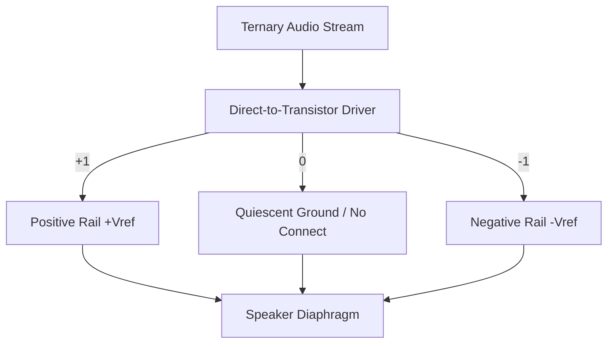

# Biologically-Aligned Ternary Audio (Opponent-Trit Audio)

Just as the human eye processes visual information using Opponent Color Theory, the human auditory system processes acoustics using **Opponent Hearing Theory**. Sound localization and auditory scene analysis rely on comparing acoustic pressure differentials across time and space.

By mapping balanced ternary (+1, 0, -1) to these physical and biological realities, we can create a **Ternary-Native Audio Architecture** that eliminates computational overhead, dramatically reduces power consumption, and achieves absolute fidelity.

---

## 1. The "Binaural Opponent-Trit" (Spatial Encoding)

In conventional binary systems, stereo audio is encoded as two independent channels: Left (L) and Right (R). This introduces massive data redundancy and requires computationally expensive calculations to manipulate spatial fields:

$$\text{Sum (Mono)} = \frac{L + R}{2}$$
$$\text{Difference (Spatial)} = \frac{L - R}{2}$$

To widen, collapse, or swap channels, the CPU must continuously execute sequences of additions, subtractions, and bit-shifts on every sample.

### The Ternary Solution
We define a **9-Trit Spatial Audio Frame** packed natively into a sub-word where the spatial components are encoded as balanced differentials:

*   **Trit 1: The Luma-Acoustic Trit (Sum / Mono Pressure)**
    *   `+1` : Air Compression (positive pressure wave)
    *   `0`  : Ambient atmospheric baseline
    *   `-1` : Air Rarefaction (negative pressure wave)
*   **Trit 2: The Spatial Opponent Trit (Left vs. Right Differential)**
    *   `+1` : Spatial dominance in Left ear (ITD/ILD shift Left)
    *   `0`  : Perfect Center (Mono / identical phase and level)
    *   `-1` : Spatial dominance in Right ear (ITD/ILD shift Right)

### Revolutionary Engineering Payoffs:
1.  **Zero-Cost Spatial Inversion**: To swap the Left and Right audio channels, you run a single **`TINV` (Ternary Invert)** instruction on Trit 2. Because `TINV` is a physical sign-flip in hardware, this spatial rotation occurs with **zero logical gates** and zero arithmetic latency.
2.  **Instant Stereo Collapse (Zero-Power Mono)**: To collapse a stereo stream to mono, the system simply drops/zeroes out Trit 2. In a dual-rail ternary circuit, a `0` trit draws **absolute zero power**. The system dynamically scales down its power consumption by half when playing mono content because the spatial component is physically uncharged.
3.  **Perfect Stereo Widening**: To widen the soundstage, the vector ALU multiplies Trit 2 by a scale factor. Because the spatial diff is isolated from the luma-acoustic mono pressure, widening doesn't cause the phase cancellation or "hollowing" artifacts common in binary spatializers.

---

## 2. Direct-to-Transistor Balanced Class-D (quiescent Silent Amplification)

Class-D amplifiers are the standard for efficient audio output on mobile and embedded devices. They convert analog waveforms into a high-frequency binary stream of pulses (Pulse Width Modulation / PWM or Pulse Density Modulation / PDM).

### The Binary Problem:
Binary switching only has two physical states: High (+V) and Low (-V). Even when playing absolute silence (0), a binary Class-D amplifier must continuously toggle between these two rails at megahertz frequencies to average out to zero. This creates:
*   Continuous idle power dissipation.
*   High-frequency electromagnetic interference (EMI).
*   Audible "idle hiss" requiring low-pass filtering.

### The Ternary Solution (True-Zero Quiescence):
In a balanced ternary system using a dual-rail physical representation, we drive a H-Bridge speaker driver directly with three states:

*   `+1` : Driver pulled to positive reference voltage ($+V_{ref}$).
*   `0`  : Driver completely disconnected / shorted to ground (High-Z or Ground).
*   `-1` : Driver pulled to negative reference voltage ($-V_{ref}$).

### Patentable Claims:
*   **Zero Idle Power**: During periods of silence, the audio stream outputs a steady stream of `0` trits. The driver transistors remain fully off. Power consumption drops to **absolute zero** (quiescence), eliminating the battery drain of idle amplification.
*   **Zero Idle Hiss**: Because the circuit does not switch during silence, there is no high-frequency switching noise to filter, delivering a mathematically perfect signal-to-noise ratio at low volumes.

---

## 3. Perfect Phase-Reversal Active Noise Cancellation (ANC)

Active Noise Cancellation works by capturing ambient noise and playing back an inverted waveform to acoustically cancel the pressure waves.

### The Binary Problem:
In two's complement binary, negating a number is asymmetric and computationally dirty:

$$-x = \sim x + 1$$

Negating a maximum negative value (e.g., `-32768` in 16-bit) causes arithmetic overflow, clipping the waveform and introducing harsh distortion. Furthermore, this integer negation requires multiple gate levels (inversion followed by a carry-propagating addition).

### The Ternary Solution:
In balanced ternary, every number is natively symmetric around zero. The negation of a sound wave is an exact, instantaneous physical operation:

$$\text{ANC Wave} = \text{TINV}(\text{Noise Wave})$$

### Patentable Claims:
*   **Zero-Latency Negation**: The cancellation wave is generated by physically routing the dual-rail lines through a polarity swapper, producing the inverted wave at propagation delay speed (picoseconds), completely bypassing the ALU.
*   **Asymmetry-Free Cancellation**: Because the ternary range is perfectly symmetric (e.g., $-13$ to $+13$ for a 3-trit amplitude), there are no boundary asymmetries. The cancellation wave can perfectly mirror the noise wave up to absolute maximum amplitude without clipping or overflow distortion.

---

## 4. Architectural Summary and Integration

| Aspect | Conventional Binary | Opponent-Trit Ternary | Physical Benefit |
| :--- | :--- | :--- | :--- |
| **Stereo Balance** | Independent L/R streams | Opponent Trit 2 (L-R Difference) | Zero-cost spatial rotation via `TINV` |
| **Mono Playback** | L and R channels active | Spatial Trit 2 set to `0` (quiescent) | 50% physical power savings |
| **Silence Amplification** | Megahertz switching at 50% duty | Transistors locked at `0` (Off) | Absolute zero idle power and hiss |
| **Noise Cancellation** | Two's complement addition ($-\text{x} = \sim\text{x} + 1$) | Polarity line-swap (`TINV`) | Zero-latency, clip-free perfect cancellation |

This ternary audio design complements the **Opponent-Trit Framebuffer** perfectly. Together, they establish a unified **Biological Media Standard** where the operating system and hardware process light and sound exactly how the human brain receives them.
