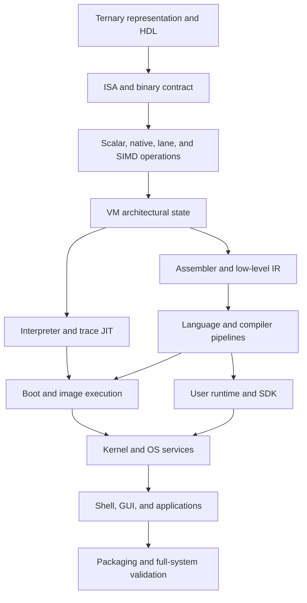

# Silicon-to-Software Review Order

This is the dependency-ordered reading and optimization plan for Trit. It is
intended to support a repeated, file-by-file review of the whole stack without
confusing architectural layers with build order.

The source files, manifests, and tests remain authoritative. This document is a
navigation plan, not a replacement specification.

## How to use this plan

For every review unit, record:

1. **Contract** - inputs, outputs, encodings, state, errors, and compatibility.
2. **Producers and consumers** - who creates the data and who relies on it.
3. **Invariants** - properties that must survive every implementation.
4. **Hot paths** - measured frequency, latency, bandwidth, and code size.
5. **Optimization candidates** - benefit, cost, and the layer responsible.
6. **Failure paths** - malformed, privileged, exhausted, and recovery cases.
7. **Evidence** - focused tests, benchmarks, diagnostics, and documentation.
8. **Disposition** - keep, clarify, optimize, redesign, or deliberately defer.

Do not optimize from instruction count alone. Compare wall time, dispatches,
memory traffic, code size, register pressure, energy proxies, and complexity.

## Taxonomy corrections

- The **ISA** is the first executable contract, not itself the first program.
  The first programs are the reset, boot, and trap assembly images.
- Registers, instruction encodings, privilege, CSRs, traps, calling convention,
  and executable/object conventions form the machine and binary contracts. The
  assembler consumes those contracts; it does not own them.
- Lexing, parsing, AST construction, type checking, and language semantics are
  the front end. SSA is primarily a compiler IR property, not a language layer.
- The interpreter and trace JIT are alternate VM execution backends. A JIT is
  not simply the stage after an ahead-of-time compiler.
- A VFS belongs to the kernel/OS substrate. The buffer pool, WAL, and relational
  state store are storage-engine mechanisms embedded in this kernel.
- x86-64 and Arm are useful design evidence, but their instruction counts are
  not goals. Much of their apparent size comes from extensions, encoding forms,
  vector widths, privilege, compatibility, and historical accumulation.

## Dependency spine

Branches at the same level can be reviewed independently, but a branch should
not be judged before its lower contracts are understood.

---

## 0. Authority, build graph, and review controls

Read first:

1. `AGENTS.md`
2. `README.md`
3. `ACCEPTANCE_CRITERIA.md`
4. `KNOWN_GAPS.md`
5. `ROADMAP_STATUS.json`
6. `TEST_MANIFEST.json`
7. `SYSCALL_MANIFEST.json`
8. `IMAGE_FORMAT_MANIFEST.json`
9. `APP_MANIFEST.json`
10. `DEBUGGING.md`
11. `CMakeLists.txt`
12. `tools/trit_tool.py`
13. the `tools/trit-*.ps1` entry points, followed by their `.cmd` shims

Review the difference between claimed, implemented, built, and tested features.
Confirm target dependencies, generated files, feature flags, host requirements,
reproducibility, test selection, and diagnostic capture.

Optimization lens: build latency, incremental rebuild accuracy, deterministic
images, test cost, benchmark stability, and observability.

## 1. Trit representation, gates, and hardware realization

Read in this order:

1. `ternary_backend.h`
2. `hdl/rtl/trit_pkg.sv`
3. `hdl/rtl/trit_gates.sv`
4. `hdl/rtl/trit_lane.sv`
5. `hdl/rtl/trit_lane_alu.sv`
6. `hdl/tb/trit_gate_tb.sv`
7. `hdl/tb/trit_lane_alu_tb.sv`
8. `hdl/trit_gate_tb.f`
9. `hdl/trit_lane_alu_tb.f`
10. `hdl/scripts/check_verible.ps1`
11. `hdl/scripts/run_icarus.ps1`

Review trit encoding, canonical/non-canonical values, truth tables, arithmetic
identities, reset behavior, combinational depth, lane layout, host/device
parity, synthesis assumptions, and testbench coverage.

Optimization lens: gate depth, fan-out, critical paths, switching activity,
packing density, vectorization, branchless host emulation, and conversion cost.

## 2. ISA, registers, privilege, CSRs, traps, and ABI

Primary file:

1. `ternary_isa.h`

Read with:

2. `docs/00_Quick_Ref/opcode_table.md`
3. `docs/00_Quick_Ref/register_map.md`
4. `docs/02_Hardware_ISA/encoding.md`
5. `docs/02_Hardware_ISA/immediate_decoding.md`
6. `docs/02_Hardware_ISA/interrupts.md`
7. `docs/04_Binary_Contract/abi_spec.md`
8. `docs/04_Binary_Contract/vector_abi.md`
9. `tests/test_isa_asm.cpp`
10. `tests_next/01_isa/next_isa_encoding.cpp`

Review:

- opcode spaces, instruction formats, field widths, and canonical decoding;
- general, special, predicate, and vector registers;
- immediates, address formation, alignment, endianness, and atomicity;
- CSR numbers, access classes, side effects, and reserved behavior;
- privilege transitions, traps, interrupts, restartability, and fault priority;
- calling convention, argument/return registers, callee saves, stack alignment,
  frame layout, varargs, aggregate returns, vector state, and syscall ABI;
- compatibility rules for reserved encodings and future extensions.

Optimization lessons to investigate from Arm and modern x86-64:

- common-case immediates and addressing modes that remove surrounding work;
- compare-and-branch, conditional select, bitfield, population-count, rotate,
  saturating, min/max, and fused multiply/add families;
- load/store pairs, multiple-register transfers, and efficient stack frames;
- predication and masking when they reduce unpredictable branches;
- acquire/release atomics and explicit memory-order encodings;
- vector-length strategy, lane permutations, reductions, and dot products;
- compact encodings for hot operations without making decode ambiguous;
- instruction fusion opportunities even when kept as separate ISA operations;
- standardized feature discovery and versioned extension groups.

Reject an opcode proposal unless a corpus or benchmark shows a recurring
sequence, the semantic boundary is stable, the compiler can select it, the VM
and hardware can implement it consistently, and the saved work exceeds added
decode/state/test cost. The goal is workload coverage, not thousands of names.

## 3. Numeric model, native operations, lanes, SIMD, and accelerators

Read in this order:

1. `ternary_uint128.h`
2. `ternary_scalar.h`
3. `ternary_math.h`
4. `ternary_native_ops.h`
5. `ternary_lanes.h`
6. `ternary_simd.h`
7. `ternary_device_allocators.h`
8. `ternary_gpu_kernels.h`
9. `ternary_gpu_validation.h`

Review widths, overflow, rounding, division, exceptional values, conversions,
comparison ordering, host fallback parity, packed-lane aliases, vector tails,
alignment, allocator ownership, and GPU/CPU result equivalence.

Optimization lens: remove representation bridges, reduce widening, specialize
common widths, use host SIMD safely, expose vector operations to the compiler,
coalesce device memory, and benchmark transfer overhead separately from compute.

Companion evidence: `tests/test_uint128.cpp`, `tests/test_native_ops.cpp`,
`tests/test_no_bridge.cpp`, `tests/test_ternary_lanes.cpp`,
`tests/test_cuda_kernels.cu`, and `tests/test_sycl_kernels.cpp`.

## 4. VM architectural state and memory system

Read:

1. `ternary_vm_state.h`
2. `docs/03_Execution_Engine/vm_state.md`
3. `docs/03_Execution_Engine/memory_model.md`
4. `docs/03_Execution_Engine/vector_engine.md`
5. `docs/03_Execution_Engine/host_interface.md`

Review register storage, program counter, CSR state, privilege, memory layout,
translation, devices, interrupts, vector/predicate state, reset snapshots, and
serialization. Define exactly which state is architectural and which is cache.

Optimization lens: state layout and locality, fast register access, translation
cache structure, bounds-check elimination with preserved faults, device dispatch
cost, snapshot cost, and false sharing in multicore execution.

## 5. VM interpreter, dispatch, trace JIT, and multicore execution

Read:

1. `ternary_vm.h`
2. `docs/02_Hardware_ISA/pipeline.md`
3. `tests/test_vm_widths.cpp`
4. `tests/test_multiwidth_vm_common.h`
5. `tests/test_multiwidth_vm_main.cpp`
6. `tests/test_execution_backends_benchmark.cpp`
7. `tests_next/02_vm/next_vm_core.cpp`

Review fetch/decode/execute, instruction boundaries, traps, syscalls, MMU
integration, atomics, vector execution, cache invalidation, multicore ordering,
trace formation, guards, exits, fallback, and JIT/interpreter equivalence.

Optimization lens: direct/threaded dispatch, predecode caches, superinstructions,
macro-fusion, hot-trace selection, constant propagation inside traces, register
caching, safe memory fast paths, code-cache invalidation, and compilation budget.

Every fast path needs a reference-execution differential test.

## 6. Assembler, disassembler, relocations, and binary contract

Read:

1. `ternary_asm.h`
2. `docs/04_Binary_Contract/asm_syntax.md`
3. `docs/04_Binary_Contract/symbolic_encodings.md`
4. `docs/04_Binary_Contract/object_format.md`
5. `tests/test_isa_asm.cpp`
6. `tests/test_tcl_asm.cpp`
7. `tests_next/03_assembler/next_assembler_goldens.cpp`
8. `tests_next/03_assembler/next_assembler_tcl_parity.cpp`

Review tokenization, directives, labels, expressions, two-pass sizing, symbol
scope, relocations, pseudo-instruction expansion, diagnostics, round trips, and
malformed input. Verify that ABI register aliases and CSR names are imported
from or checked against the ISA contract rather than becoming a second truth.

Optimization lens: linear parsing, symbol-table allocation, deterministic
layout, relaxation, compact encoding selection, and fast incremental assembly.

## 7. Low-level assembly IR and linking boundary

Read:

1. `ternary_ir.h`
2. `docs/05_Compiler_Infra/ternary_ir.md`
3. `tests/test_ternary_ir.cpp`
4. `tests/test_formats.cpp`

Review operands, labels, sections, symbols, relocation records, serialization,
assembler lowering, object composition, and link-time error handling.

Optimization lens: remove redundant moves, pool literals, place blocks and
functions for locality, relax branches, deduplicate constants, and preserve
enough metadata for diagnostics and profiling.

## 8. TCL language contract

Read before either compiler implementation:

1. `TCL_Spec_1.0.md`
2. `docs/06_Language/tcl_language.md`
3. `tcl_native_rewrite.md`

Review lexical grammar, syntax, type system, integer semantics, pointers,
ownership/lifetimes if any, evaluation order, control flow, modules, imports,
foreign calls, concurrency, undefined behavior, and compatibility policy.

Optimization-relevant language design includes explicit overflow and aliasing
rules, purity/effect information, memory order, alignment, vector types,
compile-time constants, and escape behavior. SSA itself belongs in the compiler.

## 9. Host compiler: front end through object/link output

Read in include/dependency order:

1. `ternary_compiler_types.h`
2. `ternary_compiler_lexer.h`
3. `ternary_compiler_ir.h`
4. `ternary_compiler_ast.h`
5. `ternary_compiler_parser.h`
6. `ternary_compiler_codegen.h`
7. `ternary_compiler.h`
8. `tritc.cpp`

The conceptual pass order is:

1. source and spans;
2. lexer and tokens;
3. parser and AST;
4. name resolution, types, inference, and diagnostics;
5. CFG construction and lowering to SSA;
6. IR verification and effect/alias modeling;
7. canonicalization, constant folding, dead-code elimination, CFG cleanup,
   common-subexpression elimination, propagation, and loop transforms;
8. instruction selection and ISA-specific combining;
9. register allocation, spilling, frame layout, and ABI lowering;
10. assembly/object emission, relocation, linking, and executable image output.

The include order differs slightly because AST declarations use IR/type
structures. Review both orders; do not mistake header topology for pass order.

Optimization lens: preserve source locations while simplifying, verify SSA
after each mutating pass, model memory effects conservatively, add target costs,
use profile data for layout/inlining, select fused ISA forms, minimize spills,
and compare optimized execution against unoptimized reference execution.

Companion evidence: compiler smoke `.trit` inputs and
`tests/test_phase7_compiler.cpp`, `tests/test_phase_c5_pred.cpp`,
`tests/test_production_layers.cpp`, plus `tests_next/04_compiler/`.

## 10. Self-hosted TCL compiler

Read:

1. `tcl_token.trit`
2. `tcl_lexer.trit`
3. `tcl_ast.trit`
4. `tcl_parser.trit`
5. `tcl_type.trit`
6. `tcl_infer.trit`
7. `tcl_pointer_dataflow.trit`
8. `tcl_ir.trit`
9. `tcl_backend.trit`
10. `tcl_asm.trit`
11. `tcl_frontend.trit`
12. `treatcode/compiler_driver.trit`

Compare grammar, diagnostics, types, pointer analysis, IR, code generation, and
assembly byte-for-byte or semantically with the host compiler. Document every
intentional bootstrap subset. `tcl_frontend.trit` is currently a facade, not
the entire pipeline, so verify the native compiler handoff explicitly.

Optimization lens: representation size inside the guest, allocation pressure,
linear-time scans, interned symbols, arena allocation, pass fusion only where it
does not obscure verification, and bootstrap reproducibility.

## 11. User runtime, libraries, streams, and SDK ABI

Read:

1. `ulib_mini.trit`
2. `ulib.trit`
3. `ulib_hmap.trit`
4. `ulib_c.trit`
5. `math_utils.trit`
6. `ternary_stream.trit`
7. `ternary_dataflow.trit`
8. `ternary_rle.trit`
9. `ternary_audio_dsp.trit`
10. `apps/os_sdk.trit`
11. `apps/libwidget.trit`

Review startup/exit, allocator, strings/containers, hashing, formatting, C-like
compatibility, math, streaming backpressure, dataflow scheduling, codecs, DSP,
syscall wrappers, widget protocol, and ABI parity with `SYSCALL_MANIFEST.json`.

Optimization lens: allocation count, copy avoidance, small-buffer behavior,
hash probe length, bounds checks, batching syscalls, zero-copy streams, vector
DSP, and keeping SDK wrappers thin enough for compiler inlining.

## 12. Reset, boot, trap entry, and first executable programs

Read:

1. `bootloader.tasm`
2. `native_kernel_boot.tasm`
3. `native_kernel_trap_stub.tasm`
4. `kernel.trit`
5. `docs/03_Execution_Engine/binary_loader.md`

The retired v1 `minimal_kernel_bringup.tasm` is available at Git tag
`trit-v1-final` for historical reproduction, not as a v2 runtime input.

Review reset state, image validation, memory map, stack setup, CSR programming,
privilege transition, trap frames, register preservation, BSS/data setup,
kernel handoff, failure signaling, and recoverability.

Optimization lens: boot I/O size, copy/decompression cost, cold-path code size,
trap entry/exit latency, lazy state save, and alignment of hot entry points.

## 13. Kernel foundations: HAL, memory, MMU/TLB, process, traps, and IPC

Read subsystem contracts first, then their integrated implementation:

1. `kernel/hal.trit`
2. `kernel/process.trit`
3. corresponding sections of `kernel.trit`
4. `SYSCALL_MANIFEST.json`
5. `ternary_kernel.h`

Review hardware discovery, CSR and device access, physical allocation, virtual
memory, page tables, the translation cache/TLB, address-space identifiers,
shootdown/invalidation, copy-on-write, processes, threads, scheduling, traps,
signals, syscalls, IPC, permissions, accounting, and teardown.

The small `kernel/*.trit` files are subsystem contracts/helpers; the current
monolithic `kernel.trit` does not import them. Review duplicated behavior and
drift explicitly before treating either copy as canonical implementation.

Optimization lens: allocator contention, page-table walks, TLB hit rate and
shootdowns, COW granularity, context-switch state, scheduler queues, syscall
crossing cost, lock scope, cache-line ownership, and priority inversion.

Evidence: `tests/test_layer1_hal.cpp`, `tests/test_kernel.cpp`,
`tests/test_phase_d_kernel.cpp`, `tests/test_process_handoff.cpp`,
`tests_next/07_kernel/`, `tests_next/09_process_ipc_scheduler/`, and
`tests_next/10_drivers_hal/`.

## 14. Kernel storage: BIO, buffer pool, WAL, relational state, and VFS

Read:

1. `kernel/bio.trit`
2. `kernel/vfs.trit`
3. buffer-pool, WAL, relational-state, and VFS sections of `kernel.trit`
4. `IMAGE_FORMAT_MANIFEST.json`

Review block geometry, request ordering, caching, dirty tracking, eviction,
pinning, flushing, checksums, WAL records, write-ahead ordering, transactions,
commit/rollback, replay, checkpoints, relational schema/indexes, VFS objects,
paths, mounts, descriptors, permissions, durability, and crash consistency.

Optimization lens: buffer-pool hit rate, replacement policy, write combining,
read-ahead, group commit, WAL batching, checkpoint cadence, index selectivity,
page layout, copy avoidance, path lookup caches, and lock granularity.

Correctness gates must inject crashes at every persistence boundary and verify
idempotent recovery. Use `tests_next/08_filesystem_vfs/` as the ordered future
suite, but retain the authoritative current tests until manifests promote it.

## 15. Kernel networking, graphics, devices, and services

Read:

1. `kernel/net.trit`
2. networking, device, input, display, audio, timer, and service sections of
   `kernel.trit`
3. `apps/service_stub.trit`
4. `apps/init.trit`

Review ring ownership, packet/socket state, blocking/wakeup, buffer lifetime,
driver queues, interrupts, DMA assumptions, framebuffer updates, input events,
audio timing, service lifecycle, dependency startup, and failure isolation.

Optimization lens: interrupt moderation, batching, zero-copy buffers, ring
sizing, wakeup reduction, dirty rectangles, frame pacing, audio buffer depth,
and service restart cost.

## 16. Host OS model and native integration

Read:

1. `ternary_os.h`
2. `ternary_host_runtime.h`
3. `build_tos_image.cpp`
4. `run_tos_sdl.cpp`
5. `ternary_consumer_shell.h`

Review which behavior is guest-native versus host-simulated, syscall/device
bridges, loader semantics, disk persistence, clock and input determinism,
graphics/audio adaptation, shutdown, diagnostics, and headless execution.

Optimization lens: host/guest copy boundaries, event batching, render uploads,
audio conversion, deterministic fast-forward, image caching, and profiling
hooks that do not perturb normal runs.

## 17. User space, shell, GUI, and bundled applications

Read in dependency order:

1. `apps/bin_core.trit`
2. `apps/ls.trit`, `ps.trit`, `kill.trit`, `clear.trit`, `date.trit`,
   `sleep.trit`, `mount.trit`, `fsck.trit`, `sync.trit`, `reboot.trit`, and
   `shutdown.trit`
3. `apps/login.trit` and `apps/passwd.trit`
4. `apps/shell.trit`
5. `apps/terminal.trit`
6. `apps/desktop.trit`
7. `apps/file_manager.trit`, `settings.trit`, and `task_manager.trit`
8. `apps/calculator.trit`, `paint.trit`, and `text_editor.trit`
9. `apps/about.trit`, `help.trit`, `window_probe.trit`, and `crash.trit`
10. `apps/tcc.trit`

Review command conventions, process handoff, permissions, error reporting,
terminal semantics, event routing, focus, compositing, persistent settings,
accessibility, app lifecycle, crash containment, and compiler availability.

Optimization lens: startup latency, executable size, shared library/runtime
reuse, syscall batching, event coalescing, redraw regions, memory ceilings,
background work, and responsiveness under storage or CPU pressure.

Validate against `APP_MANIFEST.json`, `tests/test_all_apps.cpp`,
`tests/test_native_apps.cpp`, and `tests_next/11_graphics_gui/` through
`tests_next/12_apps/`.

## 18. Images, loading, packaging, and distribution

Read:

1. `IMAGE_FORMAT_MANIFEST.json`
2. `build_tos_image.cpp` again as image producer
3. image-loader sections of `ternary_host_runtime.h`
4. `tools/trit-build-image.ps1`
5. `tools/trit-inspect-image.ps1`
6. `tools/trit-compact-disk.ps1`
7. `tools/trit-run.ps1`
8. `packaging/windows/README.txt`
9. `packaging/windows/LICENSES.txt`

Review headers, versioning, offsets, sizes, alignment, checksums, executable
metadata, filesystem construction, disk compaction, upgrade compatibility,
corruption rejection, licensing, staging, and release smoke tests.

Optimization lens: image size, deterministic layout, deduplication,
compression/decompression balance, demand loading, cache locality, and startup.

## 19. Specialized libraries and developer products

These are consumers of the preceding stack. Review each only after its lower
contracts:

1. `ternary_montgomery.h`
2. `ternary_transformer_runtime.h`
3. `bitnet_weights/bitnet_loader.h`
4. `bitnet_weights/bitnet_inference.h`
5. `bitnet_weights/bitnet_host_profiled.h`
6. `bitnet_weights/run_bitnet.cpp`
7. `bitnet_weights/extract_bitnet.py`
8. `bitnet_weights/download_model.py`
9. `bitnet_weights/chat_bridge.py`
10. Treatcode sources: `package.json`, `tsconfig.json`, `vite.config.ts`,
    `server.ts`, `index.html`, then `src/main.tsx`, `src/App.tsx`,
    `src/guideContent.ts`, and `src/index.css`

Review constant-time behavior for cryptography; tensor layout, quantization,
kernel selection, memory capacity, and profiling for AI; protocol validation,
resource limits, subprocess boundaries, and untrusted source handling for
developer products.

`bitnet_weights` model payloads, `treatcode/dist`, lock-derived dependencies,
`.txe` output, and `run_*.trit` are generated/downloaded artifacts. Verify their
provenance and reproducibility rather than reviewing them as foundational code.

## 20. Security, fuzzing, performance, and full-system closure

Finish with cross-cutting evidence:

1. `tests/int128_compat.h`
2. all focused files under `tests/`, in the same layer order as sections 1-19
3. `tests_next/00_harness/`
4. `tests_next/01_isa/` through `tests_next/17_full_system/`
5. `tests_next/manifests/acceptance_gates.json`
6. `tests_next/manifests/test_cases.json`
7. `tests_next/manifests/coverage_matrix.json`
8. `tests_next/manifests/status.json`
9. `tests_next/tools/validate_manifests.py`

Run correctness before optimization, differential/reference tests before fast
paths, fuzz malformed inputs at every trust boundary, and benchmark both
micro-operations and full workloads. Track latency distributions, throughput,
memory, image size, compile time, boot time, and regression variance.

The final order is:

1. focused test for the changed layer;
2. adjacent producer/consumer contract tests;
3. smoke suite;
4. production suite;
5. release image staging and inspection;
6. headless boot with exported diagnostics;
7. benchmark comparison against a recorded baseline.

## Completion rule

A layer is reviewed only when its contract is written down, its production
files and direct consumers have been examined, discrepancies have dispositions,
focused tests cover positive and negative behavior, optimization claims have
measurements, and the authoritative manifests/docs reflect the resulting truth.
Passing tests alone means the current cases pass; it does not prove the layer is
fully specified or optimized.
